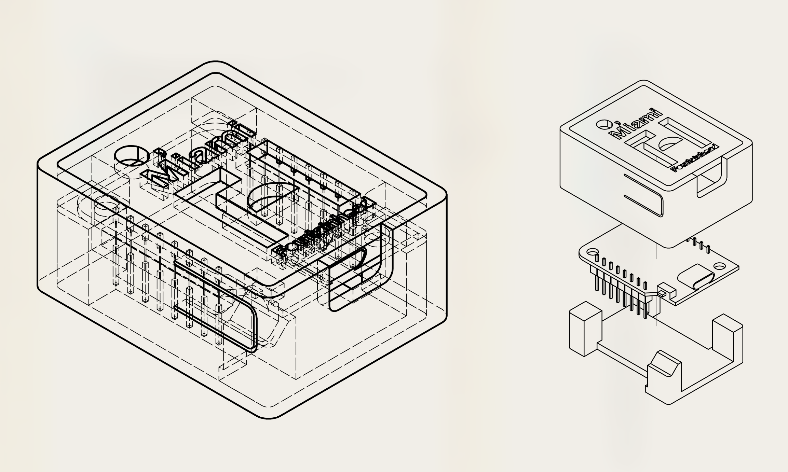
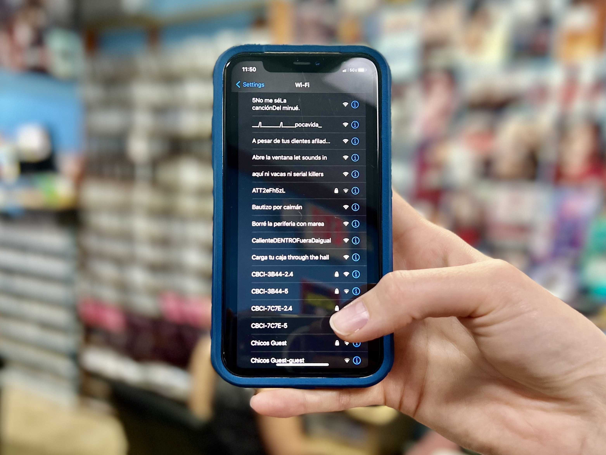

# CU.WEMOS

It is a device developed for this project to emit multiple Wi-Fi signals at the same time. It makes 
use of a WEMOS D1 Wi-Fi prototyping board, commonly used in IoT (Internet of Things) products. It 
allows extending the functionality by connecting Shields.

This device has two versions: one designed for indoors, which needs direct electrical connection and 
has a range of 100 to 150 meters of signal; and a second one developed for outdoors, with a security 
system, waterproof 3D printed box, and a self-sustainable clean energy system. This system uses a 
solar panel and its plate reuses the charging port of a recycled power bank. This outdoor version has 
a range of 200 to 300 meters of stable Wi-Fi signal and can survive for more than 5 months without 
human intervention.

The software used is based on a Wi-Fi flooder. It generates spores in the form of Wi-Fi packets and 
does not allow a stable connection, although they do appear on people’s phones as legitimate Wi-Fi 
networks.

This technique is common in the world of hacking and state espionage to take control over networks, or 
to trick users into believing they are connected to a legitimate access point when in fact they could 
be being spied on. In this project, it is used for its ability to invade the Hertzian waves with 
poetry and reproduce that scenario in the Wi-Fi parks in the Cuban context. 

For more information about this project, check out the [project page in my 
portfolio](https://nestorsire.com/en/obra/__trashed-2/).

### CREDIT

Concept co-developer & software (Amsterdam): Luis Rodil-Fernández

Editing and Correction (Cuba): J. Medina Ríos

Assistance (La Habana): Yainet Rodríguez

Copyediting (Miami): César Segovia

Graphic Design (Miami): Noah Levy

Participating Poets: Ismaray Pozo, Mario Espinosa, Gabriel Ojeda-Sagué, Oscar Cruz, Jamila Medina 
Ríos, Legna Rodríguez Iglesias, Lisann Ramos, Javier L. Mora, Adonis Ferro, Lizabel Mónica, Katherine 
Bisquet, Kyle Carrero Lopez, Sindy Rivery Elejalde, Martha Luisa Hernández Cadenas, Cuci Amador, Yosie 
Crespo, Julián Bravo Rodríguez, Ricardo Mayo, Randy Amor and Ylena Zamora-Vargas.

Havana Team

Development Lab: COPINCHA

Structural Design: Maurice Haedo

Electronic Hardware: Lázaro Alejandro Navarro Méndez

Structures Printing: Eduardo Puyol

Miami Team

Presenting Partner: O, Miami

Artist’s Residency: Fountainhead

Special Thanks: Julia Weist, Enedys Seijo Planes, Sindy Rivery, Lizabel Mónica, Chuli Herrera, Steffen 
Köhn, Petra Novackova and Paola Calvo.
